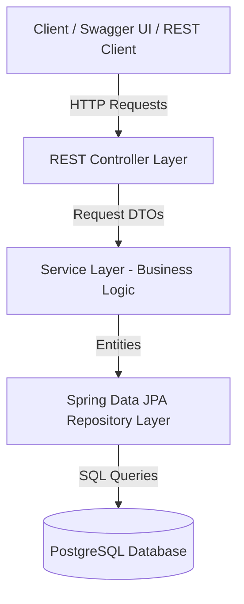

# 🚀 Agile Incident Tracker API


A RESTful API built with **Spring Boot 3** and **Java 17** designed to manage software tickets, project dependencies, and team assignments within an Agile development lifecycle.

---

## 🛠️ Key Features

* **Complete Resource Management:** CRUD operations for **Incidents**, **Projects**, and **Users**.
* **Layered Architecture:** Strict separation of concerns following `Controller -> Service -> Repository` with explicit DTO mapping (`RequestDto` / `ResponseDto`).
* **Relational Integrity & Dynamic Assignment:** Domain modeling supporting project categorization and real-time assignee updates via dedicated PATCH endpoints.
* **Global Exception Handling:** Standardized API error responses for validation failures (`400 Bad Request`) and missing entities (`404 Not Found`).
* **Containerized Environment:** Fully orchestrated using **Docker** and **Docker Compose** with multi-stage builds.
* **Comprehensive Testing:** Unit tests with **JUnit 5** / **Mockito** and integration tests using **MockMvc**.
* **Interactive API Documentation:** Integrated **Swagger UI / OpenAPI 3** dashboard.

---

## 🧰 Tech Stack

| Layer | Technology |
| :--- | :--- |
| **Language & Core** | Java 17 |
| **Framework** | Spring Boot 3 (Web, Data JPA, Validation) |
| **Persistence** | PostgreSQL, Hibernate ORM |
| **Containerization** | Docker, Docker Compose |
| **Testing** | JUnit 5, Mockito, MockMvc, H2 Database |
| **Documentation** | Springdoc OpenAPI (Swagger UI) |
| **Build Tool** | Apache Maven |

---

## 📐 System Architecture



## 📋 Agile Feature Mapping (Jira User Story Sample)

### User Story: SPIN-101 - Create Incident Ticket

> As a Software Developer / Team Lead,
>
> I want to report a system issue with priority levels and assign it to a team member,
>
> So that our engineering team can track and resolve bugs within our sprint.

#### Acceptance Criteria (AC):

1. AC1: System must validate required payload fields (title, type, priority, projectId). Returns 400 Bad Request if missing.
2. AC2: Default incident status must automatically initialize as OPEN.
3. AC3: Assigning an incident to a non-existent userId or projectId must trigger a custom 404 Not Found response with structured error details.

## 📡 API Endpoints Reference

### 📌 Incidents (`/api/v1/incidents`)

| **Method** | **Endpoint** | **Description** |
| ---------- | ------------ | --------------- |
| POST | `/api/v1/incidents` | Create a new incident ticket |
| GET | `/api/v1/incidents` | Retrieve all incidents |
| GET | `/api/v1/incidents/{id}` | Get incident details by ID |
| PATCH | `/api/v1/incidents/{id}/status` | Update incident status (OPEN, IN_PROGRESS, RESOLVED, CLOSED) |
| PATCH | `/api/v1/incidents/{id}/assignee` | Update assigned user (`?userId={id}`) |
| PATCH | `/api/v1/incidents/{id}/priority` | Update incident priority (LOW, MEDIUM, HIGH, CRITICAL) |
| DELETE | `/api/v1/incidents/{id}` | Remove an incident |

### 📌 Projects (`/api/v1/projects`)

| **Method** | **Endpoint** | **Description** |
| ---------- | ------------ | --------------- |
| POST | `/api/v1/projects` | Register a new project |
| GET | `/api/v1/projects` | Retrieve all registered projects |
| DELETE | `/api/v1/projects/{id}` | Delete a project |

### 📌 Users (`/api/v1/users`)

| **Method** | **Endpoint** | **Description** |
| ---------- | ------------ | --------------- |
| POST | `/api/v1/users` | Register a new user |
| GET | `/api/v1/users` | Retrieve all registered users |
| GET | `/api/v1/users/username/{username}` | Find user by unique username |
| DELETE | `/api/v1/users/{id}` | Delete a user |

## ⚙️ Getting Started

### Prerequisites

- Java 17 or higher
- Docker & Docker Compose
- Git

### Option 1: Running with Docker Compose (Recommended)

Clone the repository and spin up both PostgreSQL and the Spring Boot application in synchronized containers:

```bash
git clone https://github.com/PabloUsc/agile-incident-tracker.git
cd agile-incident-tracker
docker compose up --build
```

The application will start at http://localhost:8080.

### Option 2: Running Locally (Maven)

Ensure a local PostgreSQL instance is running with database incident_db, then execute:

```bash
./mvnw spring-boot:run
```

## 📖 Interactive API Documentation

Once the application is running, access the interactive Swagger UI dashboard at:
http://localhost:8080/swagger-ui.html